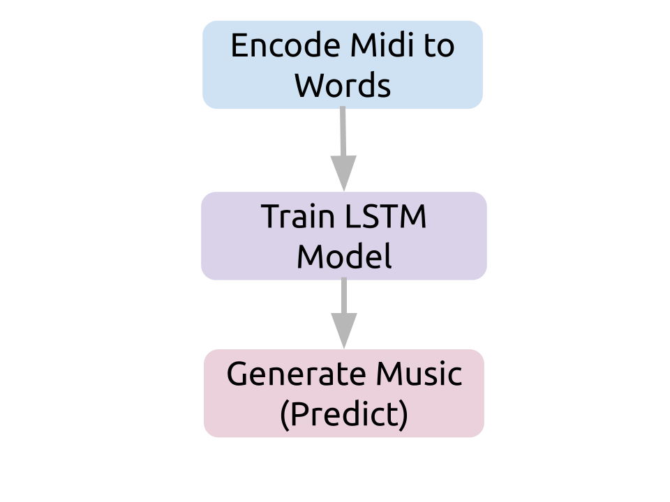

# deeporb-generator-pytorch
Deep Orb is a project about computers learning how to make music. The core approach to that is Recurrant neural network based learning models are used to teach powerful GPU based systems to compose, choose instuments, genres and ultimately produce complete musical works.

# background


## LSTM (Long Short Term Memory) and RNNs (Recurrent Neural Networks)

* [Recurrent Neural Networks by Example in Python](https://towardsdatascience.com/recurrent-neural-networks-by-example-in-python-ffd204f99470) 
* [TensorFlow Magenta](https://magenta.tensorflow.org/)

# setting up your GPU and container 
To use the [Nvidia Pytorch Docker Container](https://ngc.nvidia.com/catalog/containers/nvidia:pytorch) your host computer will need to have the correct drivers installed first. 

## CUDA for pytorch
This is the CUDA and driver version I use on Ubuntu 20.04 for this project. It is strogly reccomended that you go [directly to NVidia downloads](https://developer.nvidia.com/cuda-downloads) and make sure you have the correct driver fully installed to enable using the container

when you are finsihed `nvidia-smi` should show you something like this:

```bash
$ nvidia-smi
+-----------------------------------------------------------------------------+
| NVIDIA-SMI 450.51.06    Driver Version: 450.51.06    CUDA Version: 11.0     |
|-------------------------------+----------------------+----------------------+
| GPU  Name        Persistence-M| Bus-Id        Disp.A | Volatile Uncorr. ECC |
| Fan  Temp  Perf  Pwr:Usage/Cap|         Memory-Usage | GPU-Util  Compute M. |
|                               |                      |               MIG M. |
|===============================+======================+======================|
|   0  GeForce RTX 208...  On   | 00000000:2D:00.0  On |                  N/A |
|  0%   53C    P8    30W / 250W |    637MiB / 11016MiB |     16%      Default |
|                               |                      |                  N/A |
+-------------------------------+----------------------+----------------------+

```

[a script](./cuda_install.sh) is provided as an example and should work for Ubuntu 20.04 LTS


# the docker container
This project exclusely uses docker containers that are provided with PyTorch and are Nvidia GPU and Driver enabled.

## building the container
```
docker build -t claytantor/deeporb-generator-pytorch:latest .
```

## pulling from docker hub

```
docker pull claytantor/deeporb-generator-pytorch:latest
```


# running the scripts



## torchutils.py - test your CUDA installation
Before you run the scripts you should test that the CUDA drivers and Pytorch are working 
together. 

```bash
docker run --gpus all --shm-size=1g --ulimit \
  memlock=-1 --ulimit stack=67108864 -it \
  --rm -v $(pwd)/workspace:/workspace \
  claytantor/deeporb-generator-pytorch:latest python torchutils.py
```

and the application should give you device details:

```
__Python VERSION: 3.6.10 |Anaconda, Inc.| (default, Mar 23 2020, 23:13:11)
[GCC 7.3.0]
__pyTorch VERSION: 1.6.0a0+9907a3e
__CUDA AVILABLE: True
__CUDNN VERSION: 8001
__Number CUDA Devices: 1
__Device: cuda GeForce RTX 2080 Ti
Active CUDA Device: GPU 0
Available devices  1
Current cuda device  0
```

## downloading test data

We have created a package of public domain Beethoven files to use for running the scrip base, for these example you should put them under the `/workspace/midi/beethoven` directory.

[Beethoven Midi Files](https://deeporb-vanguard-dev.s3.amazonaws.com/mid/deeporb_beethoven_collection.tar.gz)

## encode_midi_words.py - encoding midi to words
The use of the encoder is intended to allow for the translation of midi events into words that the LSTM Network can learn from.


```python
parser.add_argument("-m", "--midi", action="store", required=True, dest="midi_dir", help="midi directory to open")

parser.add_argument("-o", "--out", action="store", required=True, dest="out", help="output dir to write to")

parser.add_argument("-s", "--session", action="store", required=True, dest="session", help="session name")
```


The three arguments are used to recursively scan through a directory for all miding files and segement them by midi instrument and then place note files in the heirchy by insrument under the session directory.

This will allow a dirctory with a collection of songs in a specific folder to be the source of training by all the shared instruments.

```bash
docker run --gpus all --shm-size=1g --ulimit \
  memlock=-1 --ulimit stack=67108864 -it \
  --rm -v $(pwd)/workspace:/workspace \
  claytantor/deeporb-generator-pytorch:latest python encode_midi_words.py \
  -m /workspace/midi/beethoven \
  -o /workspace/txt -s beethoven_words
```

will generate JSON files that encode each track as a instrument in the tree hierchy under the session name:

```bash
beethoven_words/
├── acoustic_grand_piano
│   ├── acoustic_grand_piano-5327f0.json
│   ├── acoustic_grand_piano-5fd3f0.json
│   ├── acoustic_grand_piano-70634a.json
│   └── acoustic_grand_piano-fa6ca5.json
├── bassoon
│   ├── bassoon-066fb7.json
│   ├── bassoon-0914ff.json
│   ├── bassoon-1143d4.json
│   ├── bassoon-3f1fc7.json
│   ├── bassoon-cfeab3.json
│   └── bassoon-ee5f0c.json
├── flute
│   ├── flute-3de53d.json
│   ├── flute-a36411.json
│   ├── flute-ad9538.json
│   ├── flute-b70b0c.json
│   └── flute-ca6929.json
├── oboe
│   ├── oboe-2d1557.json
│   ├── oboe-8bab24.json
│   ├── oboe-966e2d.json
│   └── oboe-9867cd.json
├── pizzicato_strings
│   ├── pizzicato_strings-0a0100.json
│   ├── pizzicato_strings-42ceac.json
│   ├── pizzicato_strings-f25a22.json
│   └── pizzicato_strings-f7d916.json
├── timpani
│   ├── timpani-02b4e1.json
│   ├── timpani-23a309.json
│   ├── timpani-56550f.json
│   ├── timpani-b7fba5.json
│   └── timpani-d10ac1.json
├── trombone
│   └── trombone-4de151.json
├── trumpet
│   ├── trumpet-02bc5c.json
│   ├── trumpet-4e0d01.json
│   ├── trumpet-7da75f.json
│   └── trumpet-e4ac18.json
└── violin
    └── violin-08d157.json
```

The file has a list of notes in common musical notation that will be turned into words for the LSTM to learn:

```json
{
    "notes": [{
        "nameWithOctave": "A3",
        "fullName": "A in octave 3 Quarter Note",
        "pitch": {
            "name": "A",
            "microtone": "(+0c)",
            "octave": "3",
            "step": "A"
        },
        "duration": {
            "type": "quarter"
        }
    }]
}
```


## train.py - use the instrument note files to train the model 

```bash
docker run --gpus all --shm-size=1g --ulimit \
   memlock=-1 --ulimit stack=67108864 -it --rm \
   -v $(pwd)/workspace:/workspace \
   claytantor/deeporb-generator-pytorch:latest python train.py \
   --data_dir /workspace/txt/beethoven_words \
   --session beethoven_words \
   --training_dir /workspace/training \
   --number 4000
```


## predict.py - use your training models to generate midi

```bash
docker run --gpus all --shm-size=1g --ulimit memlock=-1 --ulimit stack=67108864 -it --rm -v $(pwd)/workspace:/workspace claytantor/deeporb-generator-pytorch:latest python predict.py --data_dir /workspace/txt -s beethoven_words -t /workspace/training --midi_file /workspace/midi/beethoven/rondo.mid -o /workspace/midi
```